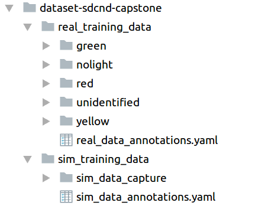

# Traffic Light Detection and Classification
This repository is a part of the Carnd Capstone Project, we want to train a model to detect traffic light and classify the state of the traffic light in real time.

## Proposed Solution
This problem can be framed as an Object Detection problem, we can have four labels: `Red, Yellow, Green` and `NoTrafficLight`. To solve this Object Detection problem, we can use the [Tensorflow Object Detection API](https://github.com/tensorflow/models/tree/master/research/object_detection). The steps are
1. Setup: create an environment for this project
2. Gather data: extract images from simulator or ros bags
3. Label and annotate the images and create TFRecord file (better supporting by [Tensorflow Object Detection API](https://github.com/tensorflow/models/tree/master/research/object_detection))
4. Transfer learning using trained model (can download from [here](https://github.com/tensorflow/models/blob/master/research/object_detection/g3doc/detection_model_zoo.md)). We fine tune the trained model's weight using our own dataset.
5. Export our trained model for inference and evaluate it on test-data and run it in real time.

In the following we describe in details each of the above steps

## Setup
We use [Tensorflow](https://www.tensorflow.org/) and [Tensorflow Object Detection API](https://github.com/tensorflow/models/tree/master/research/object_detection), so we should following the official instruction to install
* tensorflow 1.x.x: see [here](https://www.tensorflow.org/install/)
* object detection api: see [here](https://github.com/tensorflow/models/blob/master/research/object_detection/g3doc/installation.md)
* additional tools: such as `yaml`

## Gather data
When we run in simulator, the camera is populated to `/image_color`, we can extract images from this topic by using the following command (see [here](http://wiki.ros.org/image_view) for more detail)
```
rosrun image_view image_saver image:=/image_color
```

To extract image from  a bag file, one can follow the following [tutorial](http://wiki.ros.org/rosbag/Tutorials/Exporting%20image%20and%20video%20data).

## Label and annotate the image
To label and annotate the image, one can use the tool such as [LabelImg](https://github.com/tzutalin/labelImg). Here to save time, we download the annotated data from this [repository](https://github.com/coldKnight/TrafficLight_Detection-TensorFlowAPI) or directly from [here](https://drive.google.com/file/d/0B-Eiyn-CUQtxdUZWMkFfQzdObUE/view?usp=sharing).

The dataset has the following structure



where the annotations are stored in the two above `yaml`.

The next step is to create a `TFRecord` file from annotated data, one can look at examples from [Tensorflow Object Detection API](https://github.com/tensorflow/models/tree/master/research/object_detection) (in the `dataset_tools`). Adapt from above examples, we use `create_tfrecord.py` to create `TFRecord`. We include a [demo notebook on TFRecord](./notebooks/TFRecord_demo.ipynb).


